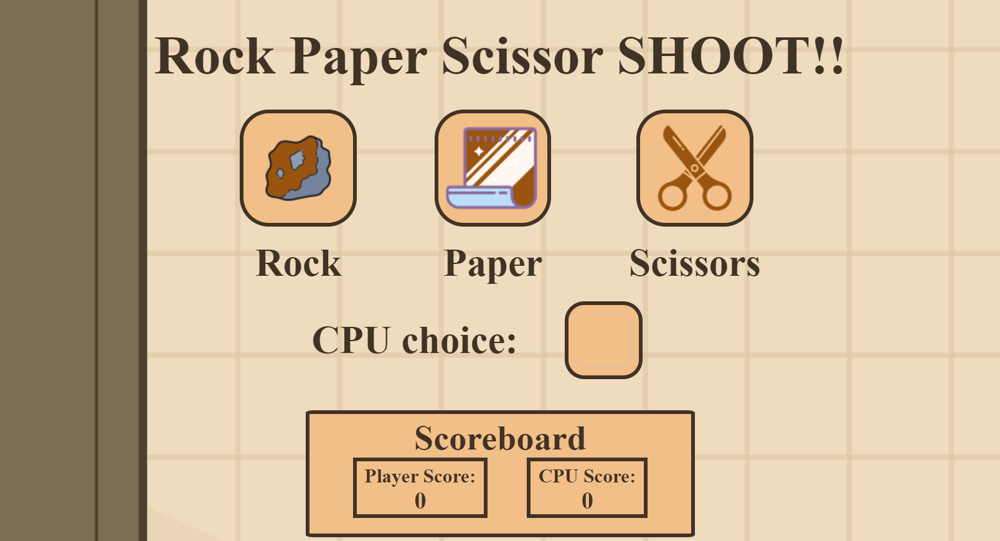

# Rock Paper Scissors Game

This project is a simple Rock Paper Scissors game developed as part of The Odin Project curriculum. It allows players to play the classic game against the computer. The game is built using HTML, CSS, and JavaScript.

## Live Demo

[Click here to play the Rock Paper Scissors game!](https://peterg-ithub.github.io/TOP-rock-paper-scissors/)

In this project, I practiced:

- Structuring HTML to create the game interface.
- Styling the game elements using CSS for an improved visual appeal.
- Implementing interactive gameplay and logic using JavaScript.
  
The game allows players to make their selection (rock, paper, or scissors) by clicking on the corresponding icons. The computer randomly chooses its move, and the game determines the winner based on the rules of Rock Paper Scissors. The outcome of each round is displayed, and the scores are updated accordingly. The game ends when either the player or the computer reaches a score of 5. Players can then choose to play again.

## Screenshot

### Main Page
